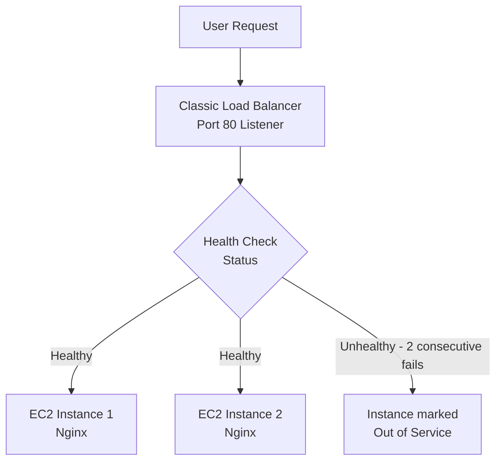
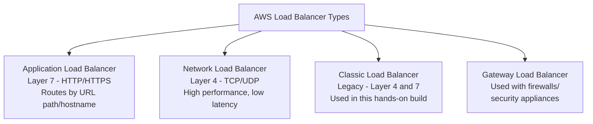
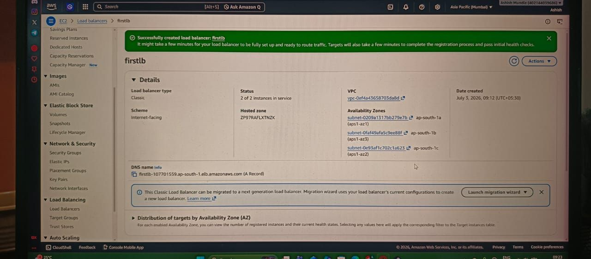

# AWS Fundamentals

## Overview

Moved into AWS after the GCP/Linux stretch — starting with core architecture concepts (DNS, load balancing, VPC, database replication) and IAM fundamentals, then into hands-on EC2 provisioning, web server setup, static IP assignment, and load balancer configuration across two EC2 instances.

## Topics Covered

**AWS architecture & IAM fundamentals**
Real-world request flow (Route 53 → Load Balancer → EC2 → Database), VPC public/private subnet model, Master-Replica database replication, and AWS's IAM structure — users, groups, policies, roles, access keys, and credential auditing via the Credential Report.

**AWS global infrastructure & EC2 fundamentals**
Regions, Availability Zones, and Edge Networks (CloudFront), plus elasticity concepts — vertical vs horizontal scaling, Auto Scaling, and AMIs.

**EC2 provisioning & web server hosting**
Launched EC2 instances on both Windows Server 2025 and Amazon Linux 2023, connected via RDP and EC2 Instance Connect respectively, installed and customized Nginx, and assigned an Elastic IP to maintain a static address across restarts.

**Load balancing**
Built a Classic Load Balancer across two EC2 instances, configured health checks and a port 80 listener, and verified traffic distribution and health check behavior.

## Hands-on — IAM & Account Setup

- Logged into AWS Console, reviewed Root User vs IAM User model
- Created IAM users and an IAM group (`Batch-44`), assigned Administrator permissions
- Created an account alias for a custom login URL
- Generated an Access Key and Secret Access Key for programmatic access
- Downloaded and reviewed the IAM Credential Report for auditing
- Tested AWS Region latency using cloudping.cloud to inform region selection

## Hands-on — EC2 Provisioning

**Windows Server 2025 instance**
Launched a T2 micro (free tier) instance, created a new key pair (OpenSSH format), left networking/storage at defaults (30GB), connected via RDP using the decrypted password from the `.pem` key.

**Amazon Linux 2023 instance**
Launched a T3 micro (free tier) instance with 8GB storage, connected via EC2 Instance Connect (no key pair needed), installed Nginx via `yum`, and customized the default `index.html` page.

**Elastic IP**
Allocated and associated an Elastic IP to keep the instance's public IP static across stop/start cycles.

## Hands-on — Load Balancer

- Created a Classic Load Balancer, configured as internet-facing on port 80 (HTTP)
- Added both EC2 instances as targets, matched security groups and VPC
- Configured health checks (5-second interval, marked healthy after 10 consecutive passes, unhealthy after 2 consecutive failures)
- Verified the load balancer was actively distributing traffic and both instances showed as in-service

### Load Balancer Request Flow

### Load Balancer Types

## KEY Notes

- **Load Balancer types:** ALB (Layer 7, HTTP/HTTPS routing), NLB (Layer 4, high-performance TCP/UDP), CLB (legacy, still in use in some setups), GWLB (used with firewalls/security appliances).
- **Stopped vs Terminated EC2:** stopping still incurs charges (resources reserved); terminating releases resources and stops billing.
- **Elastic IP:** solves the "public IP changes on restart" problem — static IP that stays attached to the instance regardless of stop/start.
- **IAM Roles vs Policies:** policies define what actions are allowed/denied; roles grant temporary permissions, typically assumed by services (EC2, Lambda) rather than individual users.
- **Health check logic:** load balancer only routes traffic to in-service (healthy) instances — prevents sending requests to a server that's down.
