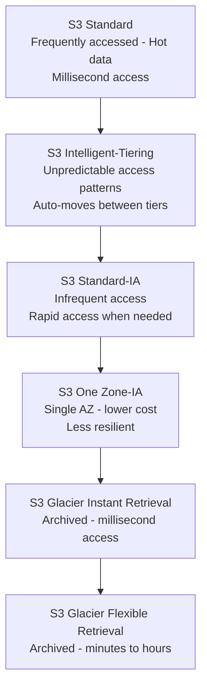

# AWS EC2 Advanced & S3 Fundamentals

## Overview

Continued AWS work — deeper EC2 configuration (key pair formats, security groups, advanced instance options, AMI backups) followed by a shift into storage with S3: bucket fundamentals, storage class tiering, and setting up AWS CLI for programmatic access.

## Topics Covered

**EC2 configuration & AMI**
Key pair formats (PEM vs PPK), Security Group configuration (open access, custom IP, CIDR ranges), advanced EC2 options (Shutdown Behavior, Instance Auto Recovery, Hibernate, Terminate/Stop Protection, User Data), and AMI as a full server backup for scaled deployment.

**S3 fundamentals & storage classes**
Bucket and object model, global naming rules, and the six S3 storage classes mapped to data access frequency — from Standard (hot) through Glacier (cold/archival).

**AWS CLI setup**
Installed AWS CLI locally, created a dedicated IAM user for CLI/automation use, and configured programmatic access via access keys.

## Hands-on — EC2 & Connectivity

- Launched a new EC2 instance ("Day 4") using Amazon Linux in the Mumbai region
- Created a key pair in RSA format (PPK variant for Windows/Putty-based tools)
- Reviewed Security Group configuration options — open access (0.0.0.0/0) vs custom IP vs CIDR range vs VPN-restricted access
- Set root volume storage to 20GB
- Connected to the instance via MobaXterm over SSH (public IP as host, `ec2-user`, private key authentication), tested drag-and-drop file transfer

## EC2 Advanced Options Covered

- **Domain Join** — adding an instance to a domain
- **Instance Auto Recovery** — AWS automatically recovers a failed instance
- **Shutdown Behavior** — choosing stop vs terminate on shutdown
- **Hibernate** — preserves in-memory state while the instance is powered off
- **Terminate Protection / Stop Protection** — guards against accidental deletion or shutdown
- **User Data** — scripts that run automatically on instance launch

## Hands-on — AWS CLI Setup

- Installed AWS CLI (MSI on Windows)
- Created a dedicated IAM user (`Terraform`) with Administrator group permissions, intended for CLI/automation use rather than console login
- Generated an Access Key and Secret Access Key for this user
- Ran `aws configure` to connect the local machine to the AWS account

## S3 Fundamentals

- A bucket is essentially a container (like a folder); data stored inside is called an object
- Bucket names must be globally unique across all of AWS since they're DNS-based
- A bucket cannot be renamed after creation, and cannot be moved to a different region (though the data inside it can be)
- S3 is built for 99.999999999% (11 nines) durability

## S3 Storage Classes

## KEY Notes

- **PEM vs PPK:** PEM is the standard key format used by Linux/OpenSSH tools; PPK is PuTTY's format for Windows-based SSH clients — same underlying key, different container format.
- **Stop vs Terminate:** stopping preserves the instance and its EBS volume (still billed); terminating deletes the instance and releases resources (EBS may still bill separately unless set to delete on termination).
- **AMI vs Snapshot:** an AMI is a full deployable server image (OS + apps + config) used to launch new instances; a Snapshot is a point-in-time backup of a single EBS volume, used for data recovery rather than full instance replication.
- **Why S3 bucket names are globally unique:** bucket names are DNS-compliant and used directly in the bucket's URL, so they must be unique across all of AWS, not just within one account.
- **S3 Lifecycle Policies:** automate moving data between storage classes or deleting it after a set time — e.g. move to Glacier after 90 days, delete after 1 year.
