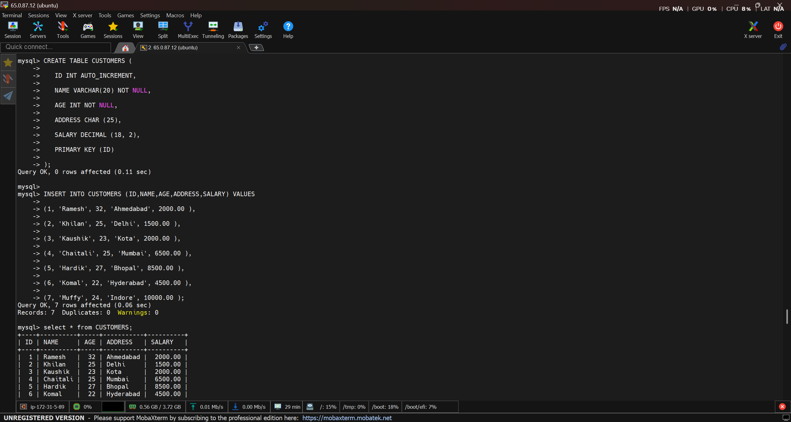
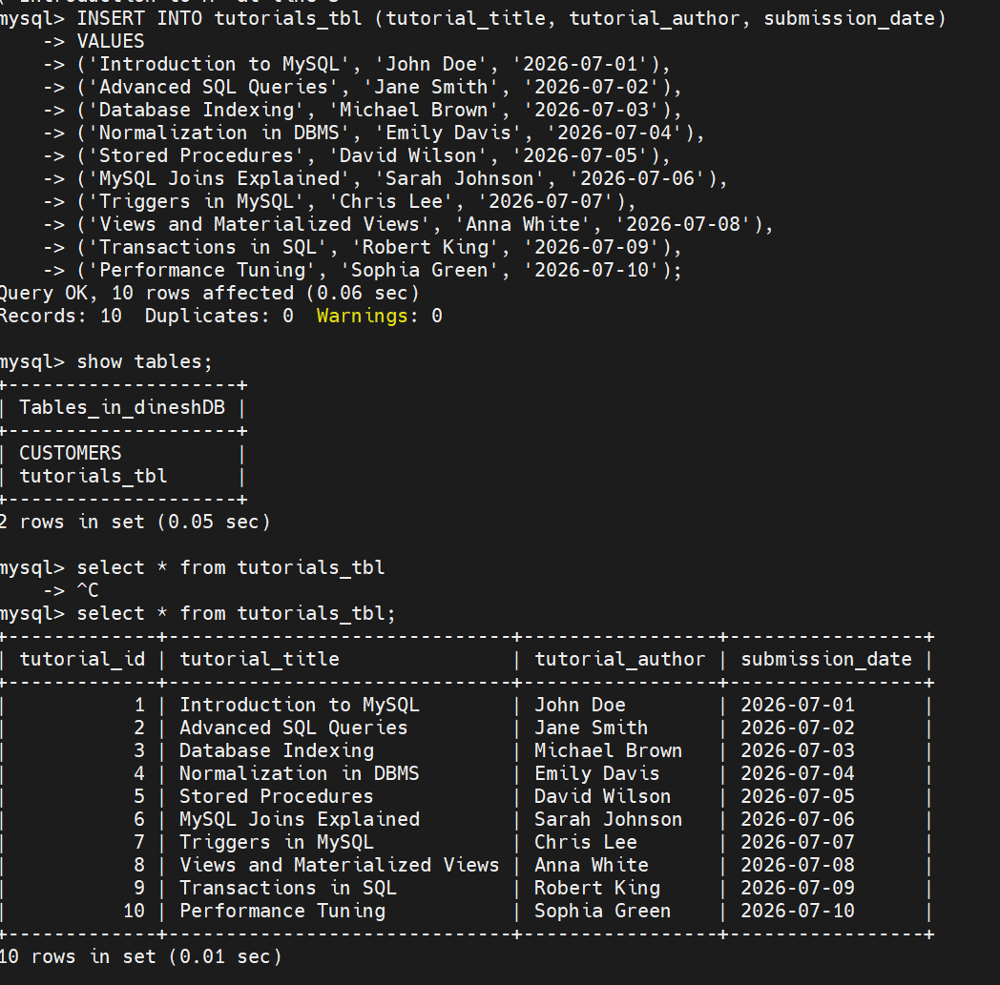
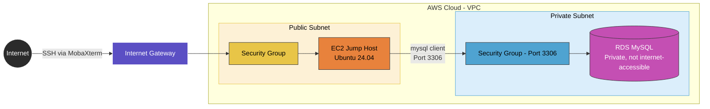

# RDS Advanced — Jump Host Connectivity & MySQL Practice

## Overview

A more advanced follow-up to the earlier RDS basics session — this time focused on the full private RDS + jump host connection flow using MobaXterm, installing a MySQL client on the jump host, and actually querying a live database (creating tables, inserting data) rather than just standing up the infrastructure.

## Topics Covered

**Private RDS + Jump Host Architecture**
Reinforced why production databases should never be public, and why a jump host (bastion) is mandatory for reaching a private RDS instance — covering the six core components involved: VPC, public subnet, private subnet, Internet Gateway, NAT Gateway, and Security Groups.

**RDS as a Managed Service (PaaS)**
Recap of what RDS handles automatically — patching, backups, failure recovery, Multi-AZ high availability, read replicas, and CloudWatch-based monitoring — versus what a self-managed setup would require.

**Backup, Recovery & Scaling Concepts**
Automated backups (full first backup, incremental after), manual snapshots, point-in-time recovery, storage auto-scaling (up-only), and read replicas for offloading read traffic from the primary instance.

**IAM Authentication for RDS**
Password + IAM authentication mode, and the general flow for IAM-based DB login (AWS CLI config + auth token generation) versus straightforward password auth.

## Hands-on — RDS + Jump Host Setup

**RDS MySQL instance**
- Created via Standard Create → MySQL 8.x → Free Tier
- Master username `admin`, auto-generated password (copied immediately from connection details, since it can't be retrieved later)
- Authentication: Password + IAM
- Storage: 20GB
- Public access: disabled — database stays private
- Enabled all log exports (audit, error, general, slow query logs)

**EC2 jump host**
- Launched an EC2 instance named `jumphost`, Ubuntu 24.04 LTS, t3.micro
- Storage increased to 20GB
- Key pair created in `.ppk` format for MobaXterm compatibility
- Placed in the same VPC as the RDS instance

**Connecting via MobaXterm**
- Opened a new SSH session in MobaXterm using the EC2 instance's public IP
- Username: `ubuntu`, authenticated using the downloaded `.ppk` private key
- Accepted the server fingerprint and connected

**MySQL client install + RDS connection (on the jump host)**

    sudo apt update
    sudo apt upgrade
    sudo apt install mysql-client
    mysql -h <RDS_ENDPOINT> -u admin -p<PASSWORD>

*(endpoint and password omitted here for security — retrieved from RDS → Connectivity & Security → Endpoint)*

## Hands-on — SQL Querying

Connected to the RDS instance from the jump host and ran real queries — created a database and table, inserted values, and queried the data back.

    CREATE DATABASE jaideep;
    SHOW DATABASES;
    USE jaideep;

    CREATE TABLE tutorials_tbl (
      tutorial_id INT NOT NULL AUTO_INCREMENT,
      submission_date DATE,
      PRIMARY KEY (tutorial_id)
    );

    SHOW TABLES;
    SELECT * FROM tutorials_tbl;

--------------------------------------------

## RDS Private Connectivity Flow

## Concepts Covered (Reviewed, Not Directly Configured)

- **Automated backups** — first backup is full, subsequent ones incremental; retention period configurable (session used 30 days vs default 7); backups can replicate cross-region for disaster recovery
- **Manual snapshots** — can be restored (creates a new instance), copied, shared, or exported to S3 for cheaper long-term storage
- **Point-in-time recovery** — restoring to a specific timestamp rather than just the latest backup
- **Storage auto-scaling** — configurable up to a max threshold (e.g., 1000GB); only scales up, never down
- **Read replicas** — offload read traffic from the primary instance; one-directional sync (master → replica), ~3 second acceptable lag
- **IAM authentication flow** — install AWS CLI, run `aws configure`, generate a DB auth token via `aws rds generate-db-auth-token` as an alternative to password login

## KEY Notes

- **Why a jump host is mandatory:** the RDS instance has no public access — the only path in is through the EC2 jump host sitting in the public subnet, exposed only on the specific port needed (3306 for MySQL).
- **MySQL client vs full MySQL install:** the client only provides connectivity to a remote database; it doesn't run a local database server — the actual DB lives entirely on RDS.
- **Vertical vs horizontal scaling for RDS:** RDS scales vertically (bigger instance/more storage) rather than horizontally (adding more DB instances) — horizontal scaling is instead achieved via read replicas.
- **Shared Responsibility Model:** AWS secures the underlying infrastructure; the customer is responsible for data protection, access management, and compliance (e.g., who has database credentials, IAM permissions).
- **`AUTO_INCREMENT`:** automatically assigns and increments a numeric value per new row without manual input — commonly used for primary key columns.
