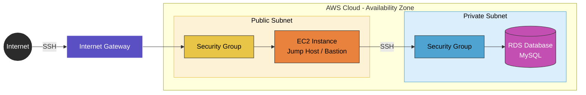
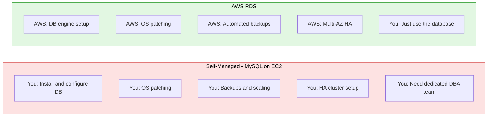

# RDS Basics

## Overview

Wrapped up the AWS stretch with databases — core DBMS concepts, relational vs NoSQL vs time-series engines, and the networking/security model RDS runs on. Closed out with hands-on creation (and teardown) of both PostgreSQL and MySQL RDS instances.

## Topics Covered

**Database fundamentals**
DBMS core concepts, SQL vs NoSQL, OLTP vs OLAP, and the three database categories covered — relational (MySQL, Oracle, PostgreSQL), NoSQL/document (MongoDB, Cassandra), and time-series (Prometheus).

**VPC & networking for RDS**
Public vs private subnet placement, Internet Gateway vs NAT Gateway, Route Tables, and Security Groups — specifically in the context of why databases belong in private subnets, accessed via a jump host.

**RDS vs self-managed databases**
Comparing a self-managed MySQL-on-EC2 setup against AWS RDS — patching, backups, scaling, and HA responsibility shifts from you to AWS with RDS.

**Production database security practices**
Encryption at rest/in transit, automated backup retention (7-90 days), Multi-AZ high availability, bastion host access patterns, read-only permission grants, enhanced monitoring, and credential rotation via Secrets Manager.

## Hands-on — RDS Creation

- Created both a PostgreSQL and a MySQL database instance through the AWS RDS console, using both the full-configuration and free-tier setup paths
- Configured auto-generated master passwords and reviewed authentication models (password-based vs IAM database authentication)
- Placed the instance in a private subnet to keep it isolated from direct internet access
- Enabled monitoring and retrieved the database endpoint and credentials once the instance was active
- Deleted both RDS instances after the exercise to avoid ongoing charges — standard cost hygiene for lab work

## Diagram 1 — Connecting to Private RDS via Public EC2 Jump Host

*The RDS instance sits in a private subnet with no direct internet access. To reach it, traffic goes: Internet → Internet Gateway → public EC2 jump host (bastion) → private subnet security group → RDS. This keeps the database itself never directly exposed.*

## Diagram 2 — Self-Managed Database vs AWS RDS

## KEY Notes

- **Why databases go in private subnets:** prevents direct internet exposure, reducing risk of SQL injection and unauthorized data access — access is routed through a bastion host or application layer instead.
- **NAT Gateway vs Internet Gateway:** IGW allows public subnet resources to be reached from the internet; NAT Gateway lets private subnet resources initiate outbound connections (e.g. updates) without allowing inbound access.
- **RDS vs self-managed:** RDS removes OS patching, backup scripting, and HA clustering from your plate — trades some control for significantly less operational overhead.
- **MySQL port:** 3306, standard default for MySQL connections.
- **Multi-AZ:** deploying across multiple Availability Zones for automatic failover if one AZ has an outage.
