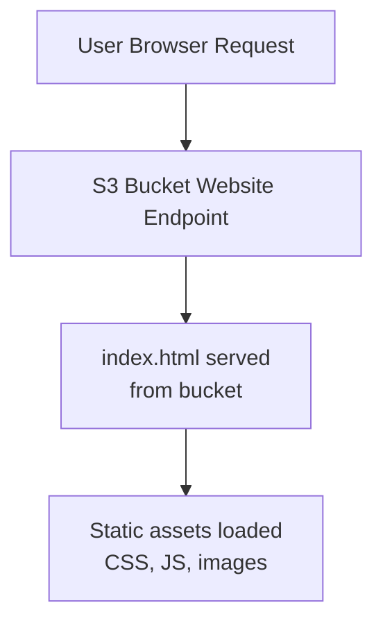
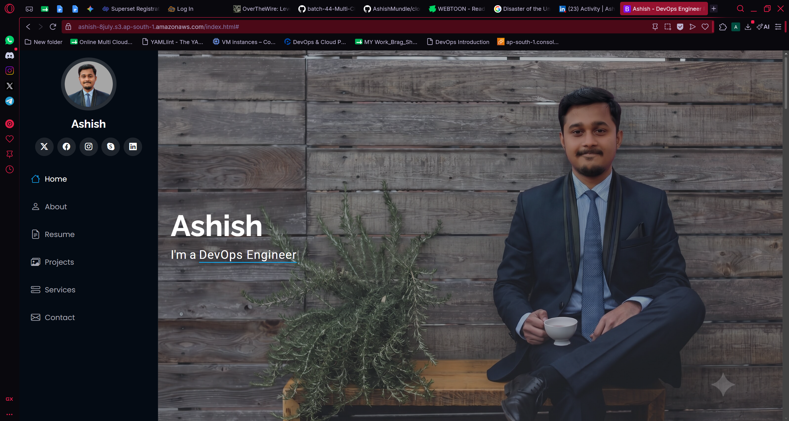

# S3 Static Website Hosting

## Overview

Hosted a static website directly on AWS S3 — covering the full manual workflow of enabling static hosting, managing bucket permissions, and making objects publicly accessible. Also reviewed how this same setup can be automated end-to-end using Terraform with CloudFront in front of it, though the automated version was instructor-demonstrated rather than something I ran myself this round.

> **Disclaimer:** The site content itself (name, bio, experience stats, contact details) comes from an unedited third-party portfolio template used only to demonstrate the S3 hosting workflow. It does not represent my actual experience, credentials, or contact information.

## Topics Covered

**S3 recap**
Buckets as containers, objects as the data inside, 99.999999999% (11 nines) durability, and lifecycle policies for automating data movement/deletion over time.

**Static website hosting — manual workflow**
Enabling static website hosting on a bucket, managing public access and ACLs, and the re-upload process required whenever a file changes.

**Automation concept (Terraform + CloudFront)**
How the same S3 static site setup can be provisioned via Terraform, with CloudFront added as a CDN layer and OAC (Origin Access Control) securing the origin — reviewed as a concept/demo rather than hands-on this round.

## Hands-on — Static Website Hosting on S3

- Created an S3 bucket with a globally unique name (`ashish-8july`)
- Enabled Static Website Hosting from the bucket's Properties tab, set `index.html` as the homepage
- Uploaded the site's files (HTML, CSS, JS, assets) to the bucket
- Unblocked public access at the bucket level (Permissions tab)
- Enabled ACLs under Object Ownership (Bucket Owner Preferred)
- Selected all uploaded objects and made them public via ACL
- Verified the site was live using the generated S3 website endpoint

**Live site:** `ashish-8july.s3.ap-south-1.amazonaws.com/index.html`
*(template placeholder content — see disclaimer above)*

## S3 Static Hosting Flow

## Re-upload Workflow (Content Updates)

Any time a file changes, the old version has to be manually replaced:
1. Delete the old file from the bucket
2. Re-upload the updated file
3. Re-apply "Make Public Using ACL" — newly uploaded files default to private, so this step is required every time

## Automation Concept — Terraform + CloudFront (Reviewed, Not Hands-on)

The instructor demonstrated how this entire setup can be automated instead of clicked through manually:

- `git clone` the provided Terraform repo
- `terraform init` → downloads providers/dependencies
- `terraform plan` → previews resources to be created
- `terraform apply` → provisions the S3 bucket, static hosting config, CloudFront distribution, and OAC settings
- CloudFront adds a CDN layer (400+ global points of presence) so the site loads fast for users regardless of region, instead of everyone hitting the Mumbai-based bucket directly

## Interview Prep Notes

- **Why buckets must be public + ACL-enabled for static hosting:** by default S3 objects are private; static website hosting requires explicitly unblocking public access at the bucket level and marking each object public via ACL.
- **Why re-uploaded files need public ACL again:** newly uploaded objects are private by default regardless of the bucket's existing public settings — permission has to be reapplied per object.
- **CloudFront's role:** acts as a CDN in front of S3, caching content closer to users globally instead of serving every request from a single region, which reduces latency.
- **OAC (Origin Access Control):** restricts direct public access to the S3 bucket, forcing traffic through CloudFront instead — a more secure pattern than a fully public bucket.