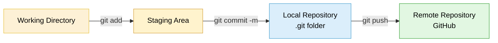

# Git & GitHub Fundamentals

## Overview

Covered Git and GitHub fundamentals — version control concepts, the staging/commit/push workflow, and first-time setup. Practiced the full local-to-remote flow myself: initializing a repo, staging and committing a file, configuring git identity, and pushing to GitHub.

## Topics Covered

**Why version control & Git overview**
The problem Git solves — tracking who changed what and when, with the ability to revert to any previous state. Git is an open-source distributed version control system used by the vast majority of companies, originally built for the Linux kernel in 2005.

**Core concepts**
Working directory vs the hidden `.git` folder (where Git's tracking data lives), the staging area (files prepped before commit), forking (cloud-to-cloud repo copy into your own account) vs cloning (downloading a repo locally).

**Git identity & first push**
One-time username/email configuration required before any commit, and browser-based authentication on first push.

## Hands-on — Local Repo to GitHub Push

    echo "# 2nd repo" >> README.md
    git init
    git status
    git add README.md

    git config --global user.email "you@example.com"
    git config --global user.name "Your Name"

    git commit -m "first ashish commit"
    git branch -M main

    git remote add origin https://github.com/<username>/<repo-name>
    git push -u origin main

## Git Workflow Diagram

*Files move through four stages: edited in the working directory, staged with `git add`, committed to the local `.git` history, and pushed to the remote GitHub repo — each step is a deliberate checkpoint, not automatic.*

## KEY Notes

- **`git revert` vs going back to an old version:** `git revert <commit-id>` creates a new commit that undoes the changes from a specific commit, rather than deleting history — safer for shared/production branches.
- **What's in the `.git` folder:** all of Git's tracking data and config for that repository — commit history, branches, remotes — hidden from normal file browsing.
- **`git add` vs `git commit`:** `add` stages a file (marks it ready), `commit` actually saves that staged snapshot with a message describing the change.
- **Why the default branch name differs:** locally Git still defaults to `master` in older setups, while GitHub defaults new repos to `main` — hence the need for `git branch -M main` to align the two.
- **Why the GitHub contribution graph matters:** interviewers can see it on your profile — consistent commit activity is a visible, informal signal of real hands-on engagement.
