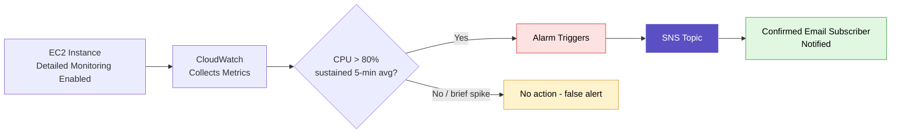

# AWS CloudWatch Monitoring

## Overview

Focused on AWS CloudWatch as the core monitoring layer for AWS resources — metric collection, alarm configuration, SNS-based notifications, centralized dashboards, and billing alerts. Set up a CPU utilization alarm tied to an SNS email subscription, built a monitoring dashboard, and configured a budget alarm to catch unexpected charges early.

## Topics Covered

**Why monitoring matters**
Resource optimization, security/forensic logging, capacity planning, resiliency, and change-impact tracking — the core reasons centralized monitoring exists rather than checking servers manually.

**How CloudWatch works**
Continuous metric/log collection from AWS services and custom applications, near real-time dashboards (historical data retained up to 3 years), threshold-based alarms, and automated actions (SNS notifications, auto-scaling, instance reboot/stop/terminate).

**Alarm configuration & severity levels**
Setting a CPU alarm (5-minute average, >80% threshold), distinguishing false alerts (single brief spike) from real alerts (sustained breach across consecutive evaluation windows), and standard severity tiers — Warning (~80-85%), Critical (~90%), P2/Actionable (~90-95%), P1 (users actively impacted).

**SNS integration**
Topics (notification channel), subscriptions (recipient endpoint requiring explicit confirmation), and how CloudWatch + SNS automates traditional L1 NOC alerting work.

**Dashboards & billing alarms**
Centralized dashboards aggregating multiple instances with color-coded differentiation, and budget alarms (EstimatedCharges metric) to catch runaway costs before they become a surprise bill.

## Hands-on — CPU Alarm + SNS Setup

- Launched an EC2 instance with **detailed CloudWatch monitoring** enabled via Advanced Settings (basic monitoring is free/default; detailed monitoring is opt-in and paid)
- Navigated to the instance's Monitoring tab → Metrics → selected CPU Utilization → Create Alarm
- Set the alarm condition: **Average over 5 minutes, greater than 80%**
- Created a new SNS topic and added an email subscriber
- Confirmed the SNS subscription via the confirmation email (required before any alerts get delivered)
- Named the alarm descriptively for easy identification in the console

## Hands-on — Dashboard Creation

- Created a centralized dashboard ("Batch 44") to aggregate monitoring graphs across instances
- Added the EC2 instance to the dashboard via Monitoring tab → Add to Dashboard
- Each instance appears as a distinct color on shared graphs, supporting easy visual differentiation as more machines get added

## Hands-on — Billing / Budget Alarm

- Navigated to Billing & Cost Management → Billing Alarms
- Set the alarm metric to **EstimatedCharges**, currency INR, threshold **300 INR**
- Created a new SNS topic for the budget alarm, added an email subscriber, confirmed the subscription
- Reviewed the AWS billing breakdown (Billing → Bills) to see service-by-service, region-by-region cost drivers

## CloudWatch Alert Flow

## KEY Notes

- **False alert vs real alert:** a single brief spike within one evaluation window is a false alert; a sustained breach across 2-3 consecutive windows is a genuine alert requiring action.
- **Alert severity levels:** Warning (~80-85%, informational) → Critical (~90%, investigate) → P2/Actionable (~90-95%, active remediation) → P1 (application down, users impacted — the only tier where "P1" is actually appropriate).
- **Why one alarm per metric, not per machine:** a single CPU alarm can cover multiple instances — reduces alarm sprawl and matches real-world practice at scale (100+ machines).
- **Basic vs Detailed monitoring:** basic is free and default; detailed monitoring must be explicitly enabled and incurs additional cost.
- **Reading a surprise AWS bill:** check Billing → Bills for a service/region breakdown — bills are global, not filtered to your primary region, so forgotten resources (like an idle Elastic IP) in an unused region are a common hidden cost driver.