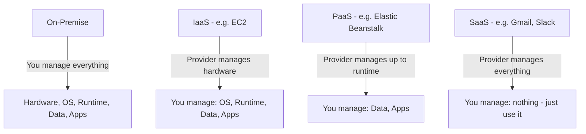
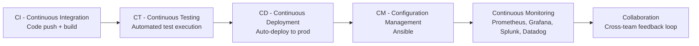
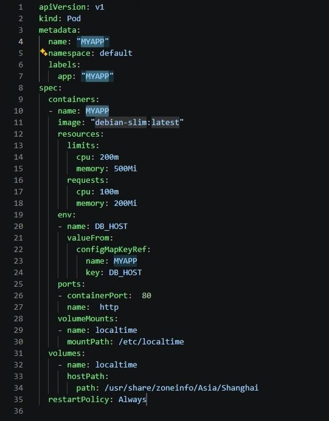

# Phase 01 – Cloud, DevOps & AI Fundamentals

## Overview

Consolidating core cloud, DevOps, and AI-tooling concepts as part of an ongoing multi-cloud (GCP → AWS) DevOps track. This phase covers foundational service models, the DevOps delivery pipeline, and where AI fits into day-to-day engineering workflows — including a hands-on pass with AI-assisted manifest generation.

## Topics Covered

**Cloud fundamentals & service models**
Cloud computing vs traditional data centers, deployment types (public/private/hybrid/community), and the service model spectrum (IaaS/PaaS/SaaS/FaaS/CaaS) — with EC2, Docker, and Kubernetes as the recurring reference points.

**DevOps culture & delivery pipeline**
The Dev/Ops split and why DevOps bridges it, Agile vs Waterfall vs DevOps, and the CI/CT/CD/CM/Monitoring pipeline. Mapped out the standard tool stack per stage (Jenkins, Docker, Kubernetes, Terraform, Ansible, Prometheus/Grafana).

**AI in the engineering workflow**
Generative vs Agentic AI vs AGI, prompt engineering (CRAFT framework) vs vibe coding, and where each fits into DevOps work — followed by a hands-on run with GitHub Copilot's Kubernetes Templates extension.

## Service Models Ladder

## The 6 C's Pipeline

## Tools Reference

| Stage | Tool(s) |
|---|---|
| Planning | Jira |
| Version Control | Git |
| IDE | VS Code |
| Build | Maven |
| Testing | Selenium, JMeter |
| CI/CD | Jenkins |
| Containerization | Docker |
| Orchestration | Kubernetes |
| IaC | Terraform |
| Config Management | Ansible |
| Monitoring | Prometheus, Grafana, Splunk, Datadog |

## Hands-on: AI-assisted Kubernetes Manifest Generation

Set up GitHub Copilot in VS Code (`Ctrl+Shift+I`) with the Kubernetes Templates extension installed. Used the `kube.pod` snippet trigger to auto-generate a complete Pod manifest (apiVersion, kind, metadata, spec) instead of hand-writing the boilerplate — useful as a quick-start baseline before customizing image, resource limits, and labels.

## KEY Notes

- **Cloud computing, in short:** accessing infra (compute/storage/db/network) over the internet instead of owning it — trades capex for opex, seconds-scale elasticity instead of days.
- **IaaS vs PaaS vs SaaS:** control vs convenience tradeoff. IaaS = you manage OS up (EC2). PaaS = you manage code only (Elastic Beanstalk). SaaS = you manage nothing (Gmail, Slack).
- **DevOps in short:** culture + automation bridging Dev and Ops — CI → CT → CD → CM → Monitoring, aimed at shortening release cycles without sacrificing stability.
- **Prompt Engineering vs Vibe Coding:** structured, controlled instruction-giving (CRAFT: Context, Role, Action, Format, Target) vs tool-driven auto-generation with less control — different tradeoffs depending on how much precision the task needs.

## Key Takeaway

Cloud service models set the boundary of what you're responsible for, DevOps automation is how you move fast within that boundary, and AI tooling (prompt engineering, Copilot-style assistance) is increasingly part of how that automation gets written faster — not a separate track.