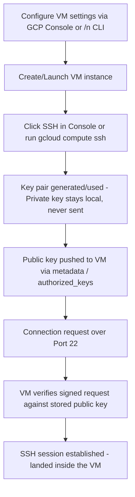

# Linux Basics

## Overview

Building on cloud fundamentals with a deep dive into Linux — kernel/shell mechanics, GCP VM provisioning, SSH key-based access, and core system administration commands. This stretch moved from theory into real hands-on work: spinning up VMs, connecting via SSH, and working through file system, log, and process management on a live machine.

## Topics Covered

**Kernel, Shell & Linux fundamentals**
Kernel vs Shell distinction, Linux history (1991, Linus Torvalds, ~97% C, Unix lineage from 1969), Linux vs Unix, Linux vs Windows comparisons.

**GCP VM & SSH setup**
Created GCP VM instances (Ubuntu LTS), connected via SSH (port 22), generated and inspected SSH key pairs, worked through the public vs private key access model.

**Linux administration basics**
File system navigation, log inspection, process/service checks, and system resource monitoring — reinforced across sessions with repeated practice.

## SSH Connection Flow (GCP)

## Hands-on

**File system & navigation**

    pwd
    cd /
    ls
    cd /var/log/
    cd ..
    cd tmp/
    mkdir rakesh
    touch file
    vi file

**Log inspection**

    cat auth.log
    more auth.log
    tail -20 auth.log
    tail -20f auth.log
    head -20 auth.log
    cat auth.log | grep error
    cat auth.log | grep failed

**Networking**

    hostname
    hostname -i
    curl ifconfig.me

**SSH / key management**

    ssh-keygen
    cd /root/.ssh/
    cat id_ed25519.pub    # public key - safe to view/share
    cat id_ed25519        # private key - content intentionally omitted here for security

**Service management**

    apt-get update && apt install nginx -y
    ps -ef | grep nginx

**System monitoring**

    uname -a
    top
    htop
    uptime
    free -h
    df -h
    du
    who
    w
    whoami
    ps -ef

## Interview Prep Notes

- **Kernel vs Shell:** kernel talks to hardware, shell is the user-facing interpreter that passes commands to the kernel.
- **SSH key pairs:** public key goes on the server / shared with whoever grants access; private key stays local, never shared. Port 22 by default.
- **Linux vs Unix:** Linux is free/open-source; Unix is licensed, still preferred in some enterprise/banking setups for dedicated support.
- **Monitoring basics:** `top`/`htop` for live process view, `free -h` for memory, `df -h` for disk, `uptime` for verifying a machine restarted after patching.
