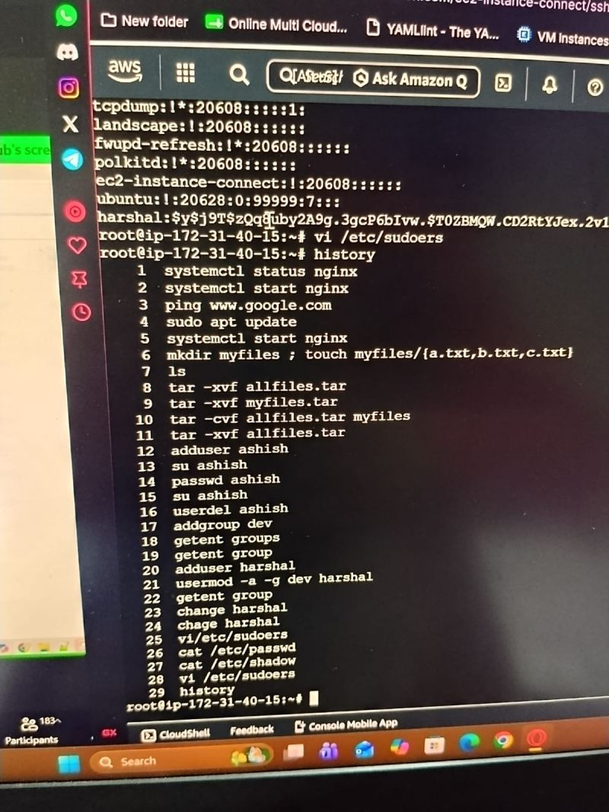

# Linux Advanced

## Overview

Moved deeper into Linux administration — archiving with tar, user/group lifecycle management, core networking diagnostic tools, and basic shell scripting with permission handling. This stretch involved more real troubleshooting (permission errors, tool installs) than pure command memorization.

## Topics Covered

**Archiving & user/group management**
Working with `tar` for archiving/extraction, and the user lifecycle — creating users and groups, resetting passwords, removing users, and inspecting account metadata via `/etc/passwd` and `/etc/group`.

**Networking diagnostics**
Practiced core network troubleshooting tools — interface inspection, connection state, DNS resolution, routing, and domain lookups.

**VI editor & shell scripting**
File creation/editing in `vi`, writing a short shell script, and working through a real execute-permission issue.

## Hands-on — Archiving & User/Group Management

    systemctl status nginx
    systemctl start nginx
    ping www.google.com
    sudo apt update
    mkdir myfiles ; touch myfiles/{a.txt,b.txt,c.txt}
    ls
    tar -cvf allfiles.tar myfiles
    tar -xvf allfiles.tar
    adduser ashish
    su ashish
    passwd ashish
    userdel ashish
    addgroup dev
    getent group
    adduser harshal
    usermod -a -g dev harshal
    getent group
    chage harshal
    vi /etc/sudoers
    cat /etc/passwd
    cat /etc/shadow    # sensitive - password hash data, not shown/reproduced here

## Hands-on — Networking Diagnostics

    ifconfig
    apt install net-tools
    netstat
    ss
    dig google.com
    nslookup google.com
    route
    traceroute google.com
    whois flipkart.com
    ifplugstatus
    hostname

## Hands-on — VI Editor & Shell Scripting

    vi mohit
    cat mohit
    vi shalini.sh
    cat shalini.sh
    ./shalini.sh
    chmod +x shalini.sh
    ./shalini.sh
    ls -l

`shalini.sh` was a short 4-5 line script using a variable and an `echo` statement — nothing complex, mainly written to practice execute permissions and script execution.

## Challenges & Fixes

Ran `shalini.sh` directly and hit a permission-denied error since the script wasn't executable. Checked with `ls -l`, confirmed the execute bit was missing, fixed it with `chmod +x shalini.sh`, and re-ran successfully. Small thing, but a good reminder that a fresh script needs execute permission before it'll run — not just correct content.

## KEY Notes

- **RM vs RM-RF:** `rm` deletes a file; `rm -rf` force-deletes recursively (folders + contents) — no confirmation, no undo, use carefully.
- **Public key vs private key:** public key shared for access grants, private key never leaves the local machine.
- **`chmod +x`:** grants execute permission — required before running any custom shell script directly (`./script.sh`).
- **`/etc/passwd` vs `/etc/shadow` vs `/etc/group`:** passwd = user account info, shadow = encrypted passwords (root-only), group = group membership info.
