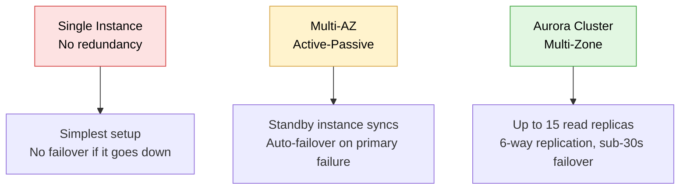
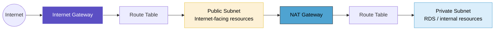

# RDS Aurora & VPC Networking

## Overview

A concept-heavy session covering RDS/Aurora deployment architectures and the underlying VPC networking model that supports them — no new hands-on build this round, but solid groundwork on how databases scale, fail over, and connect across public/private subnets.

## Topics Covered

**RDS deployment architectures & Aurora**
The three RDS architecture patterns (Single Instance, Multi-AZ, Aurora Cluster), Aurora's performance advantages over standard MySQL/Postgres, and Provisioned vs Serverless capacity models.

**VPC & networking fundamentals**
VPC/subnet structure, Internet Gateway vs NAT Gateway roles, route tables, CIDR sizing, and a broader networking refresher — OSI model layers, IPv4 vs IPv6, and network types (LAN/WAN, unicast/multicast/broadcast).

## Diagram 1 — RDS Deployment Architectures

## Diagram 2 — VPC Traffic Flow (Public ↔ Private Subnet)

## Key Concepts

**Aurora vs standard RDS**
Aurora is AWS's proprietary MySQL/Postgres-compatible engine — roughly 5x faster than standard MySQL and 3x faster than Postgres, supporting up to 15 read replicas, 6-way replication, ~10ms sync latency, 128TB auto-scaling storage, and automatic failover in under 30 seconds. Not available outside AWS (no Azure/GCP equivalent).

**Provisioned vs Serverless**
Provisioned requires manually configuring CPU/memory ahead of time; Serverless scales automatically based on demand without pre-defined capacity.

**Networking basics covered**
CIDR /16 sizing (65,536 internal IPs, standard for enterprise VPCs), OSI model layers, IPv4 (32-bit) vs IPv6 (128-bit, not yet common in enterprise VPC setups), and core network types (LAN, WAN, intranet vs internet, TCP/UDP, unicast/multicast/broadcast).

## Interview Prep Notes

- **How does an app route queries to read vs write endpoints?** Decided at design time, not runtime — read-only functions are hardcoded to the replica endpoint, write functions to the primary endpoint.
- **What happens if the primary fails and a replica gets promoted?** The endpoint abstraction (DNS-level) handles this transparently — the application keeps using the same endpoint reference; traffic redirects without the app needing to change anything.
- **How would you migrate an on-premise database (e.g., Oracle) to AWS?** AWS Database Migration Service is the standard tool, typically planned using the 6R migration framework (Rehost, Replatform, Repurchase, Refactor, Retire, Retain).
- **Why is horizontal scaling not used for databases the way it is for compute?** Data duplication and sync consistency issues make it impractical — vertical scaling (bigger instance) or read replicas are used instead.
- **CIDR /16 sizing:** gives 65,536 internal IPs — standard for enterprise VPCs anticipating growth across pods, containers, and microservices.