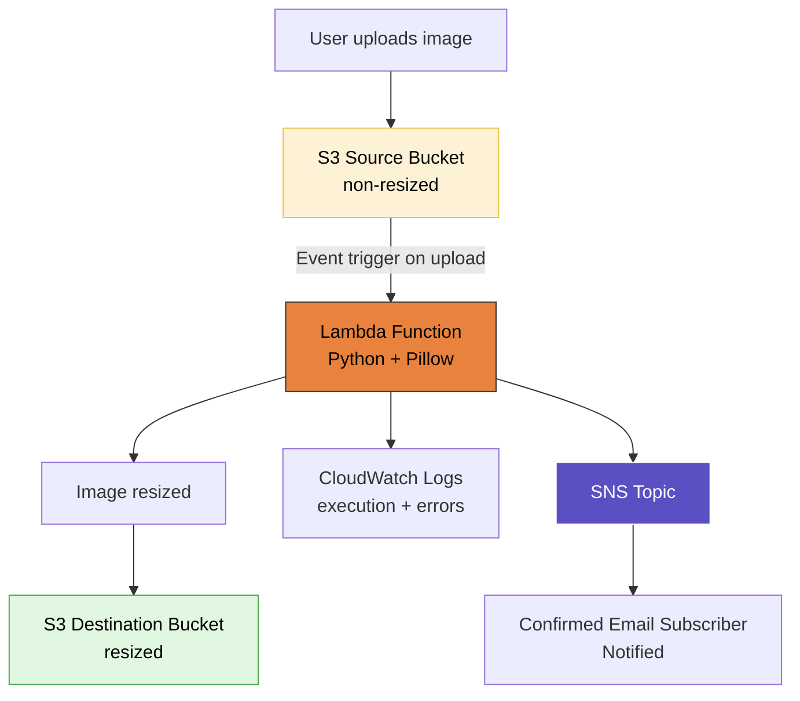
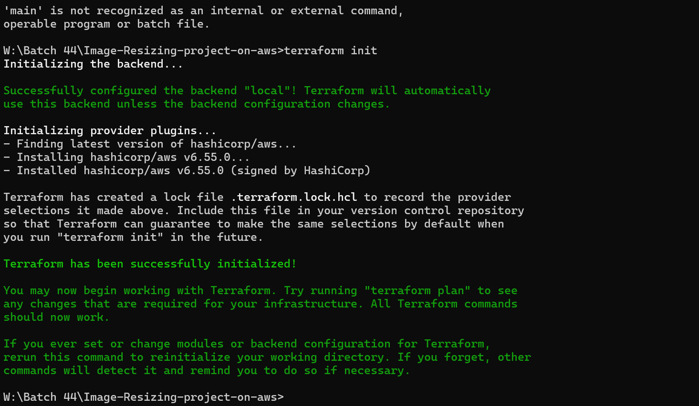
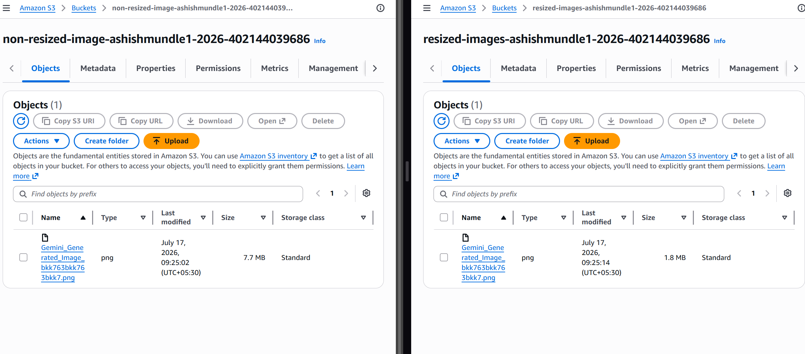

# Serverless Image Resizing Pipeline (Lambda + S3 + Terraform)

## Overview

Built and deployed a serverless image resizing pipeline on AWS — combining S3 event triggers, a Python/Pillow Lambda function, SNS email notifications, and Terraform for full infrastructure-as-code provisioning. Completed the entire workflow personally: wrote/reviewed the Terraform config, ran the deployment, tested the pipeline end-to-end with a real image upload, and confirmed the resize actually worked.

## Topics Covered

**Serverless & Lambda fundamentals**
Event-driven, stateless execution model — Lambda runs only when triggered (e.g., an S3 upload), bills per millisecond of compute, and scales automatically without any server management. Compared against EC2's continuous, always-on model to understand when each is the right fit.

**Architecture patterns**
Monolithic vs microservices vs serverless/event-driven — and why a sporadic, event-based workload (image uploads) suits Lambda far better than a persistently running EC2 instance.

**Infrastructure as Code with Terraform**
Provisioning S3 buckets, the Lambda function, IAM roles/policies, and an SNS topic entirely through Terraform (`provider.tf`, `main.tf`, `lambda_policy.json`) rather than manual console clicks.

## Architecture Flow

## Hands-on — Deployment

**Terraform provisioning**

    terraform init
    terraform plan
    terraform apply

Ran into a `'main' is not recognized` error initially (PATH issue before running from the correct project directory) — resolved by running the commands directly from the project folder in CMD. `terraform init` successfully configured the local backend and installed the AWS provider.

**Resources provisioned by Terraform:**
- Two S3 buckets — one source (`non-resized-image-...`) and one destination (`resized-images-...`), each with a globally unique name
- Lambda function (Python runtime, Pillow for image processing)
- IAM role/policy granting Lambda access to S3, SNS, and CloudWatch
- SNS topic with an email subscription
- CloudWatch log group for execution logging

## Hands-on — SNS Notification

Created and confirmed the SNS email subscription — required before any notifications actually get delivered.

## Hands-on — End-to-End Test

Uploaded a real image to the source bucket and confirmed the full pipeline worked as expected:

- **Source bucket:** original image at 7.7 MB
- **Destination bucket:** resized image at 1.8 MB (Lambda triggered automatically on upload, processed the image with Pillow, and wrote the result to the destination bucket)

## KEY Notes

- **Why Lambda over EC2 here:** the workload is event-driven and infrequent (image uploads), not continuous — Lambda avoids paying for idle compute and scales automatically without any manual configuration.
- **Stateless vs stateful:** Lambda is stateless — each invocation is independent with no memory of prior calls, unlike a long-running EC2 process that maintains state across requests.
- **How the S3 → Lambda trigger works:** S3 generates an event on object creation, which invokes the Lambda function and passes event metadata (bucket name, object key) so the function knows exactly what to process.
- **Why Terraform over manual console setup:** reflects real DevOps practice — infrastructure is defined as code, version-controlled, and reproducible, rather than manually clicking through the console each time.
- **Real-world Lambda users:** Netflix, Airbnb, and Coca-Cola all run production workloads on Lambda — useful to know for grounding the "why serverless" conversation in real adoption.
