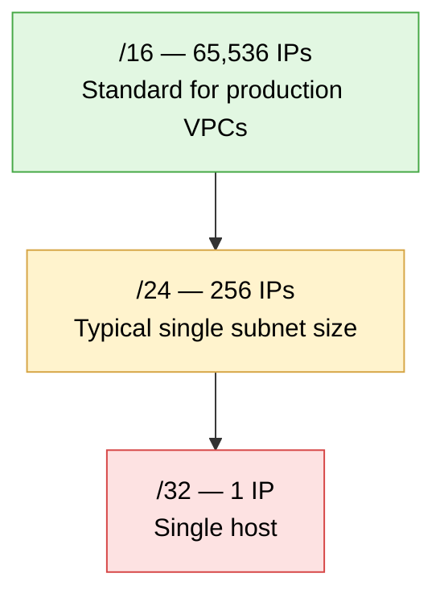
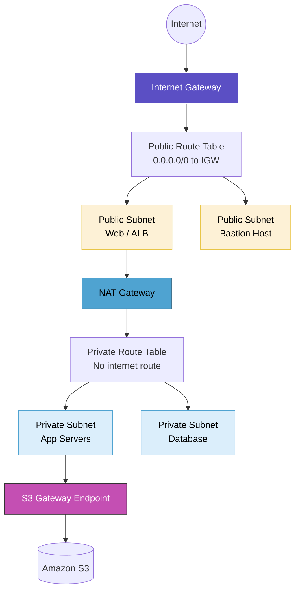
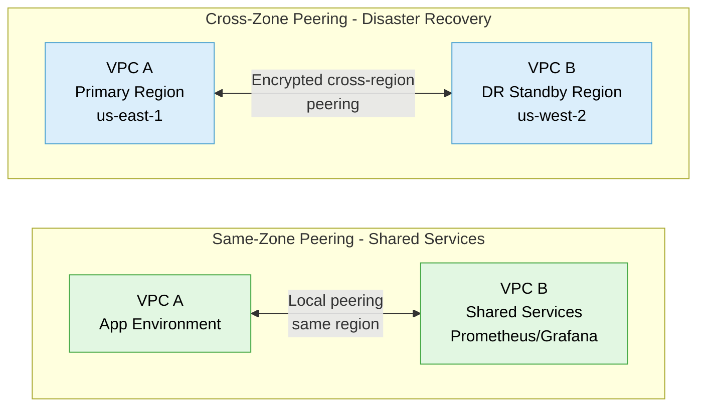

# VPC Networking Deep Dive

## Overview

A deep dive into AWS VPC networking — CIDR math, subnet segmentation, routing, peering, and real-world enterprise architecture patterns. This session was concept and demo-heavy: watched a live VPC build and cross-account peering demo rather than building one hands-on this round, but came away with a solid architectural reference for how production VPCs are typically structured.

## Topics Covered

**VPC fundamentals & CIDR sizing**
What a VPC is, how CIDR ranges determine available IP space, and why most production environments default to /16 to leave room for growth.

**Subnets, routing & gateways**
Public vs private subnet design, Internet Gateway vs NAT Gateway roles, route table behavior, Elastic IPs, and VPC Endpoints (S3 Gateway Endpoint for private connectivity to S3).

**Security groups**
Instance-level firewall rules — inbound/outbound traffic control, and how they compare to GCP's firewall rules / VPC-level NACLs.

**VPC Peering**
Same-zone vs cross-zone peering, directional connection behavior, CIDR overlap restrictions, and real-world use cases (shared services, disaster recovery, mergers/acquisitions needing cross-account data sharing).

**Enterprise architecture scenarios**
Reference patterns covering centralized shared services (monitoring/logging across VPCs), cross-region disaster recovery replication, and a secure e-commerce deployment keeping backend/storage access entirely private.

## Diagram 1 — CIDR Sizing Breakdown

*Fewer fixed bits = more available IPs. A /16 VPC (10.0.0.0/16) can be subdivided into many /24 subnets, each holding 256 IPs — enough per Availability Zone while leaving room to grow.*

## Diagram 2 — Enterprise VPC Layout (4-Subnet Model)

*Public subnets handle internet-facing traffic (web/ALB, bastion); private subnets stay unreachable from the internet, using NAT for outbound access and an S3 Gateway Endpoint to reach S3 without ever touching the public internet.*

## Diagram 3 — VPC Peering: Same-Zone vs Cross-Zone

*Same-zone peering links VPCs within one region for low-latency shared infrastructure; cross-zone peering bridges regions for resilience — both require the receiving side to explicitly accept the connection, and neither works if the two VPCs have overlapping CIDR ranges.*

## Hands-on / Observed Demo

Watched a live walkthrough of building a VPC from scratch:

- Created a VPC ("Sashi") with CIDR `10.0.0.0/16`
- Created a subnet `10.0.0.0/24` in Availability Zone `us-east-1a`
- Created an Internet Gateway, attached it to the VPC (initially detached — attaching is a separate explicit step)
- Reviewed the "VPC and More" console wizard, which auto-creates the full stack (VPC, public/private subnets per AZ, route tables, IGW, NAT Gateway, S3 endpoint, DNS settings) in one click — equivalent to ~14-15 manual CLI commands
- Watched a live cross-account VPC peering demo — one account sent a peering request, the other explicitly accepted it, connection status moved from pending to active

## Real-World Scenarios (Reference)

- **Shared services peering:** centralizing monitoring/logging tools (Prometheus, Grafana) in one VPC, peered privately to multiple application VPCs — avoids duplicate tool licensing per team
- **Disaster recovery peering:** a live production database in one region continuously streams updates to a warm-standby database in a different region via cross-region peering, protecting against regional outages
- **Private e-commerce architecture:** public ALB handles customer traffic, but application servers and S3 asset access stay entirely in private subnets — reducing the attack surface since most backend services never need a public IP

## Interview Prep Notes

- **Security Groups vs NACLs:** Security Groups operate at the instance level (stateful); NACLs operate at the subnet/VPC level (stateless) — interview shorthand: "instance-level → Security Group, VPC-level → NACL."
- **Why VPC peering can fail:** overlapping CIDR ranges block peering outright — AWS returns an explicit error rather than allowing it.
- **Peering is directional:** an accepted A→B peering connection does not automatically allow B→A traffic; the reverse needs its own peering setup.
- **Elastic IP cost behavior:** an unattached Elastic IP is billed at a higher rate than one actively attached to a running resource — a common surprise cost if left dangling.
- **Why most production EC2 instances don't have public IPs:** in a typical microservices setup, only the public-facing layer (e.g. frontend/ALB) needs one — backend services communicate privately, which is both more secure and avoids unnecessary public exposure.